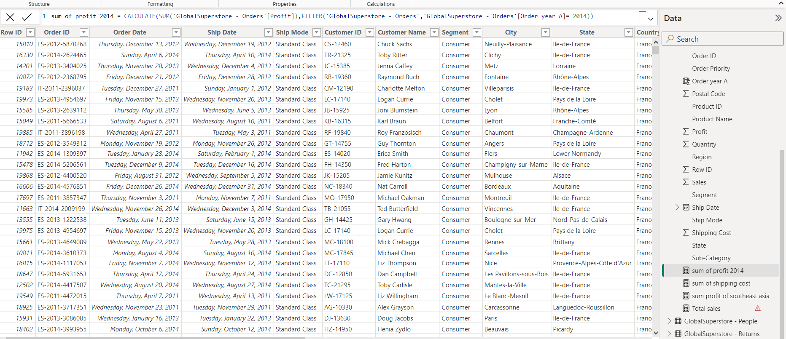
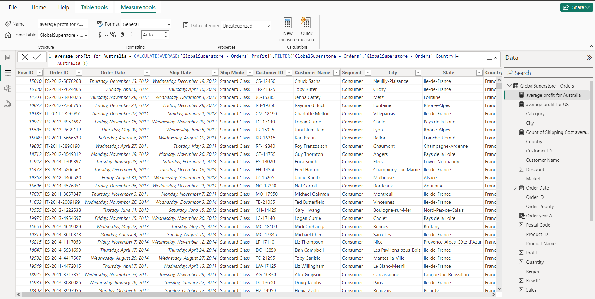
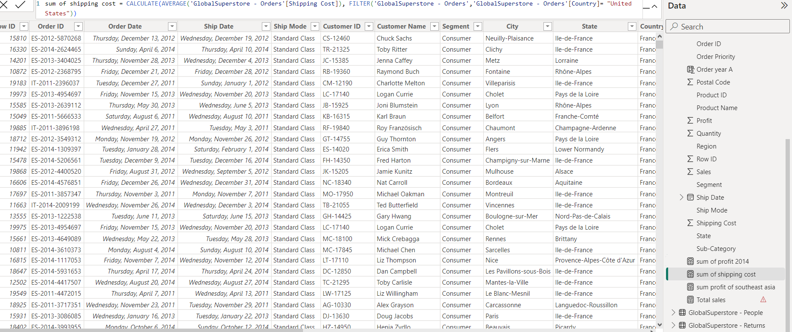
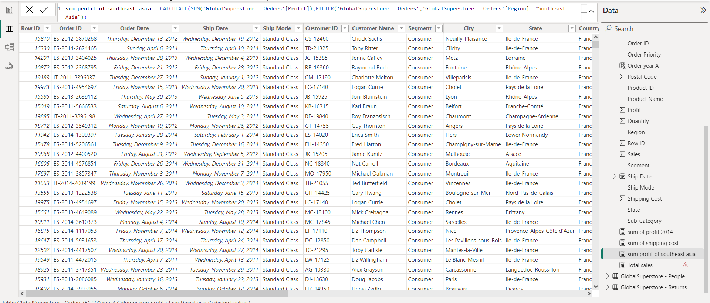
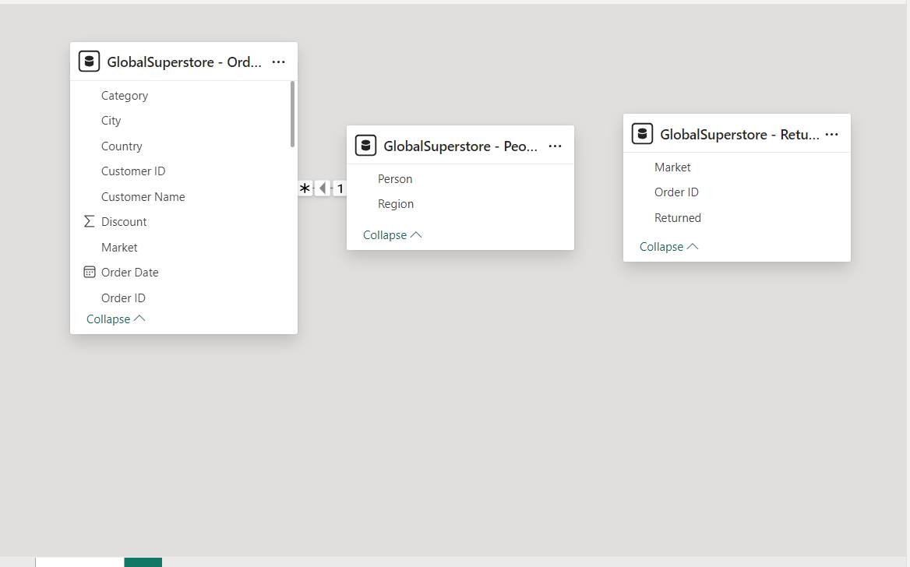
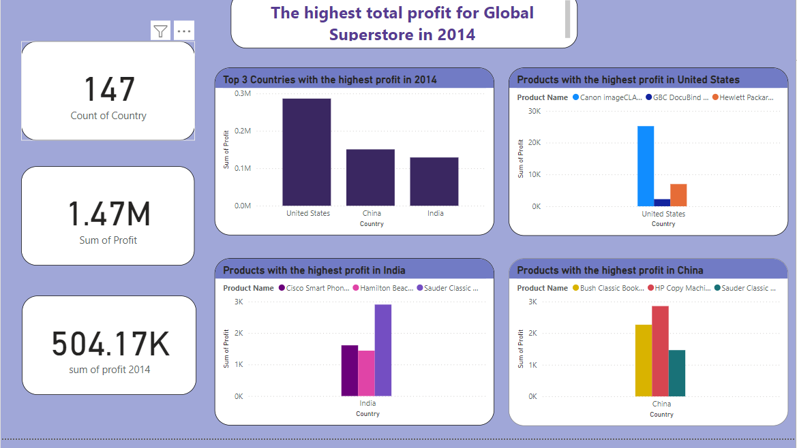
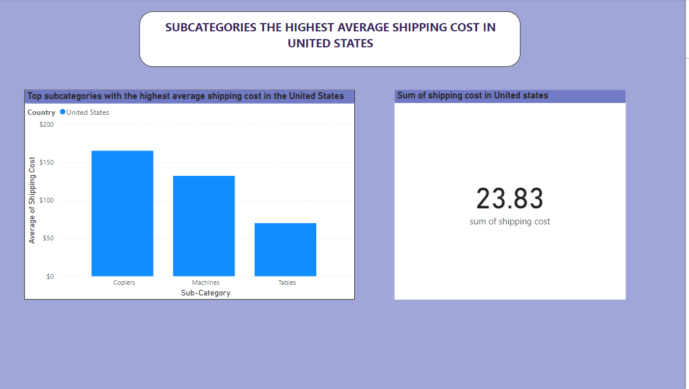
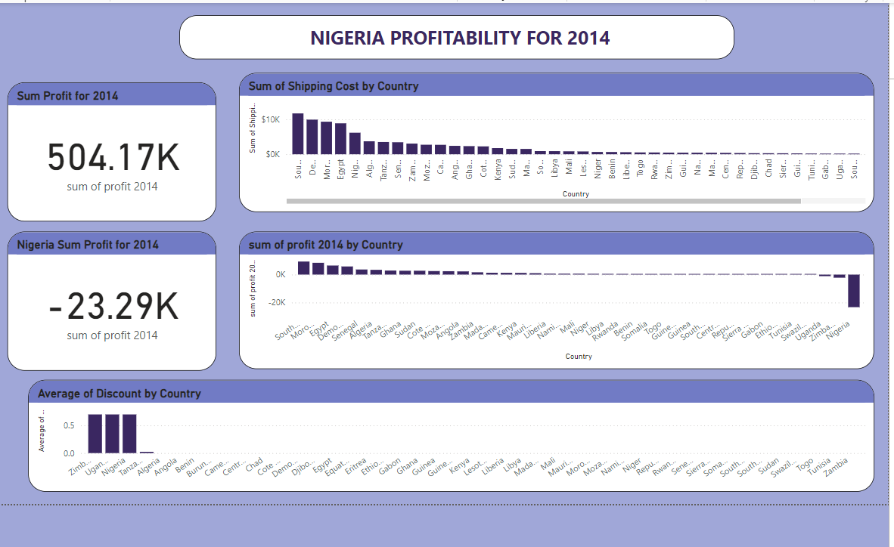
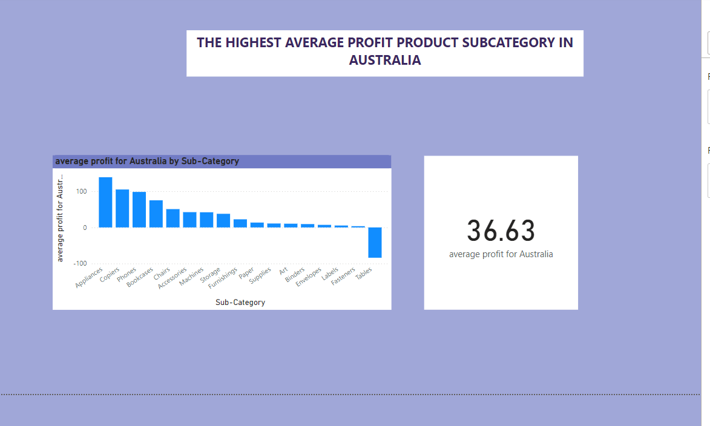
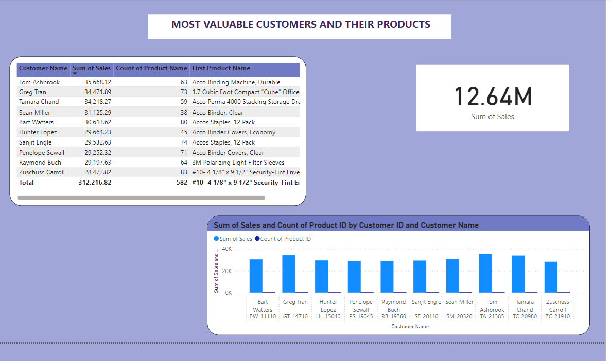

## Global-Superstore-Rating

 

# Introduction
This is a power BI project on Global Superstore analyze called Global Superstore. The project is to analyze and derive insights to answer crucial questions and this which would aid management in making informed decisions to improve performance and profitability.

# Problem Statement
- What are the three countries that generated the highest total profit for Global Superstore in 2014?
- For each of these three countries, find the three products with the highest total profit. Specifically,
what are the products’ names and the total profit for each product?
- Identify the 3 subcategories with the highest average shipping cost in the United States.
- Assess Nigeria’s profitability (i.e., total profit) for 2014. How does it compare to other African
countries?
- What factors might be responsible for Nigeria’s poor performance? You might want to investigate
shipping costs and the average discount as potential root causes.
- Identify the product subcategory that is the least profitable in Southeast Asia.
Note: For this question, assume that Southeast Asia comprises Cambodia, Indonesia, Malaysia, Myanmar
(Burma), the Philippines, Singapore, Thailand, and Vietnam.
- Is there a specific country i n Southeast Asia where Global Superstore should stop offering the
subcategory identified in 4a?
- Which city is the least profitable (in terms of average profit) in the United States? For this analysis,
discard the cities with less than 10 Orders. 5b) Why is this city’s average profit so low?
- Which product subcategory has the highest average profit in Australia?
- Who are the most valuable customers and what do they purchase?

# Skills Demonstrated
- Power Query
- Data Modeling
- Data Cleaning
- Data Visualization
- Knowledge of generating actionable insights

# Data sourcing 
Global Superstore is a global online retailer based in New York, boasting a broad product catalog and aiming to be a one-stop-shop for its customers. Global The superstore’s clientele, hailing from 147 different countries, can browse through an endless offering with more than 10,000 products. This large selection comprises three main categories: office supplies (e.g., staples), furniture (e.g., chairs), and technology (e.g., smartphones). link of dataset
https://docs.google.com/spreadsheets/d/1nxESpFzWjlGDMGDVLH69xmDzIl9l6OEq/edit#gid=633280281

# Data transformation
Data cleaning and transformation was carried out using power query. After scrutinizing all the columns, they were found to be valid and devoid of empty cells and errors. However, it was highly important to replace value for empty cells.
Data was efficiently cleaned and transformed with power query editor of Power BI ( image) some of the applied steps included
-	Making first rows as headers in the dataset
-	Format data cells by filling empty cells, replacing null cells with values
-	Datatype then change from “DECIMAL” TO “WHOLE NUMBER”
-	New measure 
-	Close and apply

New measures for Sum profit

New measures for Average profit for Australia

New measures for average profit for US

New measures for sum of shipping cost

New measures for Sum profit of southasia

Modelling

Automatically derived relationships are adjusted to remove and replace unwanted relationships with the required.

The model is a star schema.
There are 5-dimension tables and 1 fact table. The dimension tables are all joined to the fact table with one-many relationship

# Analysis & Visualizations
The report comprises of 7 pages 
1.	The highest total profit for global superstore in 2014
2.	Average shipping cost in US
3.	Assess Nigeria profitability
4.	The least profitable product subcategory in  southeast asia
5.	The least profitable city in US
6.	The highest average profit product subcategory in australia
7.	The most valuable customers and their products
-

 

1.	The highest total profit for global superstore in 2014

The sum of profit in 2014 is a total of 504.17k. From the dashboard, it’s observed that United states, China and India are the top 3 countries with highest profit in 2014. In United states, the 3 top products are Canon image class 2200 advanced copier with sum profits of 25,199.93, hewlett Packard laser jet 3310 copier with sum profit of 6,983.88 and GBC docubind TL300 electric binding system with sum profits of 2,233.51. in India, the top 3 products are sauder classic bookcase with sum of profit 2,903.58, cisco smart phone with  caller ID with sum profits with 1,609.38 and Hamitton beach  refrigerator with sum profits with 1,440.24. in China, the top 3 products are HP copy machine with sum of 2,855.13, bush classic bookcase with sum profit of 2,266.68 and sauder classic bookcase with sum profit of 1,463.08.

2.	Average shipping cost in US

From the dashboard, it’s observed that the top 3 average highest of shipping cost in united states are; copiers with average shipping cost of $165.29, machines with average shipping cost of $132.25 and tables with average cost of $69.95. 

3.	Assess Nigeria profitability

From the dashboard, it’s observed that Nigeria profitability is -23,285.19 which is the lowest compare to other Africa countries. The shipping cost in Nigeria is $6,183.11 and average discount of 0.70.

4.	The least profitable product subcategory in  southeast asia

From the dashboard, it’s observed that the least product subcategory are tables with the sum of -10,680.28, Indonesia accessories with sum of profit of -4.795.40 and Indonesia supplies with sum of profit of -2,518.35. Indonesia country should stop offering the subcategory as running in losses 

6.	The least profitable city in US

From the dashboard, it’s observed that Lancaster is the least profitable city in terms of average profit in united states.

6.	The highest average profit product subcategory in australia

From the dashboard, it’s observed that  appliances with average profit of 139.01 is the highest average profit in australia

7.	The most valuable customers and their products

From the dashboard, it’s observed that Tom Ashbrook is the most valuable customers with a total purchase of 63 items such as Acco binding machine, durable and so on

# Conclusion and recommendation

The dataset can greatly improve its decision-making process, which will increase performance and profitability, by utilizing data analytics. The data's primary conclusions emphasize the significance of concentrating on high-value product categories. Improving regional strategies will also help to sustain sustainable growth. Putting these suggestions into practice will assist Global Superstore in improving its market position and providing better service to its broad international customer.

