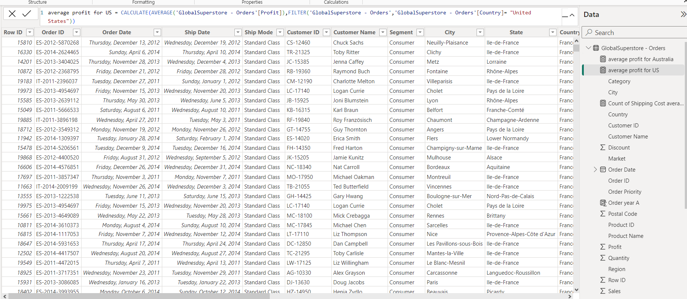

## Global-Superstore-Rating

 |

# Introduction
This is a power BI project on Global Superstore analyze called Global Superstore. The project is to analyze and derive insights to answer crucial questions and this which would aid management in making informed decisions to improve performance and profitability.

# Problem Statement
1a) What are the three countries that generated the highest total profit for Global Superstore in 2014?
1b) For each of these three countries, find the three products with the highest total profit. Specifically,
what are the products’ names and the total profit for each product?
2a) Identify the 3 subcategories with the highest average shipping cost in the United States.
3a) Assess Nigeria’s profitability (i.e., total profit) for 2014. How does it compare to other African
countries?
3b) What factors might be responsible for Nigeria’s poor performance? You might want to investigate
shipping costs and the average discount as potential root causes.
4a) Identify the product subcategory that is the least profitable in Southeast Asia.
Note: For this question, assume that Southeast Asia comprises Cambodia, Indonesia, Malaysia, Myanmar
(Burma), the Philippines, Singapore, Thailand, and Vietnam.
4b) Is there a specific country i n Southeast Asia where Global Superstore should stop offering the
subcategory identified in 4a?
5a) Which city is the least profitable (in terms of average profit) in the United States? For this analysis,
discard the cities with less than 10 Orders. 5b) Why is this city’s average profit so low?
6a) Which product subcategory has the highest average profit in Australia?
7a)Who are the most valuable customers and what do they purchase?

# Skills Demonstrated
● Power Query
● Data Modeling
● Data Cleaning
● Data Visualization
● Knowledge of generating actionable insights

# Data sourcing 
Global Superstore is a global online retailer based in New York, boasting a broad product catalog and aiming to be a one-stop-shop for its customers. Global The superstore’s clientele, hailing from 147 different countries, can browse through an endless offering with more than 10,000 products. This large selection comprises three main categories: office supplies (e.g., staples), furniture (e.g., chairs), and technology (e.g., smartphones). link of dataset
https://docs.google.com/spreadsheets/d/1nxESpFzWjlGDMGDVLH69xmDzIl9l6OEq/edit#gid=633280281

# Data transformation
Data cleaning and transformation was carried out using power query. After scrutinizing all the columns, they were found to be valid and devoid of empty cells and errors. However, it was highly important to replace value for empty cells.
Data was efficiently cleaned and transformed with power query editor of Power BI ( image) some of the applied steps included
•	Making first rows as headers in the dataset
•	Format data cells by filling empty cells, replacing null cells with values
•	Datatype then change from “DECIMAL” TO “WHOLE NUMBER”
•	New measure 
•	Close and apply

Modelling
Automatically derived relationships are adjusted to remove and replace unwanted relationships with the required.

